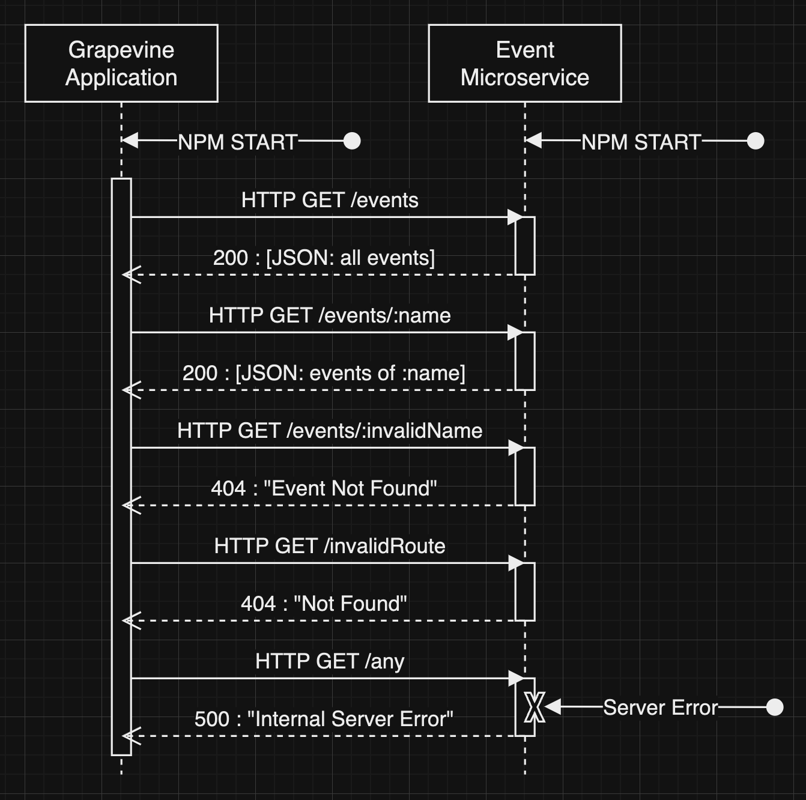

# Grapevine Events API

The Grapevine Events API is a simple, Express-based API designed to serve event data. This guide will help you set up the project locally, run the server, understand the different routes, and interpret error codes. This microservice is designed to interact with the Grapevine App developed by Gemini Kaushik.

## Author
Zachary Maes

## Setup Instructions

### Prerequisites

- Ensure you have Node.js installed on your system. If not, download and install it from [Node.js official website](https://nodejs.org/).

### Installation

1. Clone the repository to your local machine:
   ```bash
   git clone https://github.com/zacmaes/grapevine-events-api.git
   cd grapevine-events-api
   ```

2. Install the necessary packages:
   ```bash
   npm install
   ```

3. Start the server:
   ```bash
   npm start
   ```

After running the above command, the server will be running on `http://localhost:8081`. Feel free to change the port inside of the `api.mjs` file.

## API Routes

### Get All Events
```HTTP
GET /events HTTP/1.1
Host: http://localhost:8081
Accept: application/json
```
```
Example URL: http://localhost:8081/events
```
- **Endpoint:** `/events`
- **Method:** `GET`
- **Description:** Retrieves a list of all events.
- **Success Response:** Code 200 (OK), returns an array of events.

### Get Events by Name
```HTTP
GET /events/:name HTTP/1.1
Host: http://localhost:8081
Accept: application/json
```
```
Example URL: http://localhost:8081/events/the-moth
```
- **Endpoint:** `/events/:name`
- **Method:** `GET`
- **Description:** Retrieves events matching a specific name. The name should be hyphenated if it consists of multiple words. For example: "The Moth" should be 'the-moth' inside the url. The api will return all events that match the name. Functunality has been included to allow for spaces (%20) to be read instead of hyphens. The url param names may also be sent case-insensitively.
- **URL Parameters:** `name` (string) - The name of the event, hyphenated (red-light-cafe).
- **Success Response:** Code 200 (OK), returns an array of matching events.
- **Error Response:** Code 404 (Not Found) if no events match the given name.

## Handling Errors

- **404 Not Found:** Returned when a requested resource cannot be found.
- **500 Internal Server Error:** Indicates an unexpected condition that prevented the server from fulfilling the request.

## Development

- The event data is currently static, loaded from `events.mjs`. To update or add new events, modify this file.
- You may or may not need to change the cors middleware to add your origin url (ask Zac for assistance if cors issues arise.)
- You may change the `const port = 8081;` to whatever port number you want to use for the microservice.

## UML Sequence Diagram



